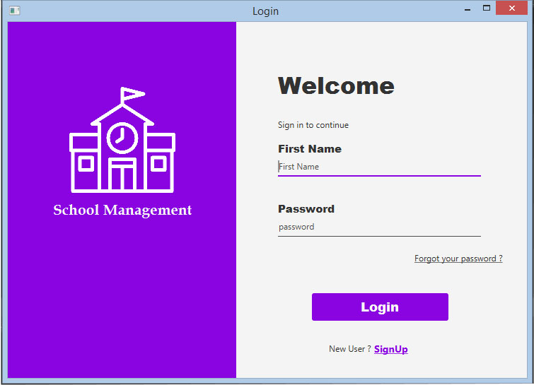
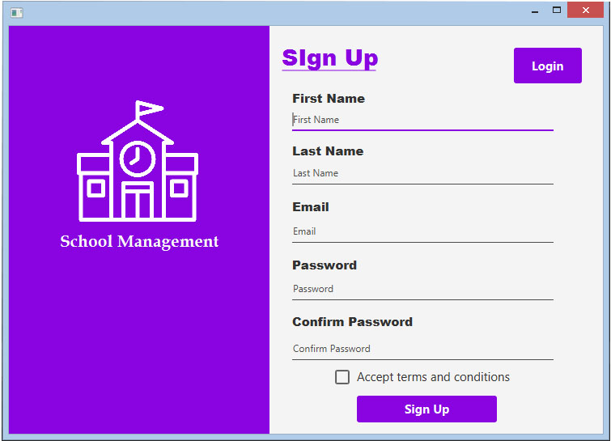
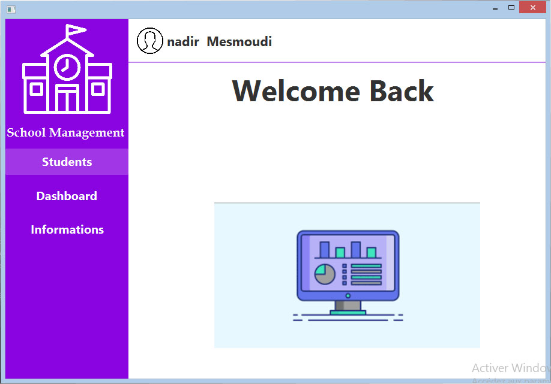
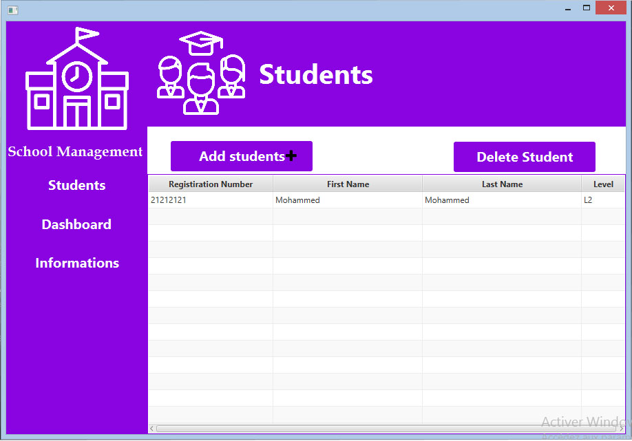
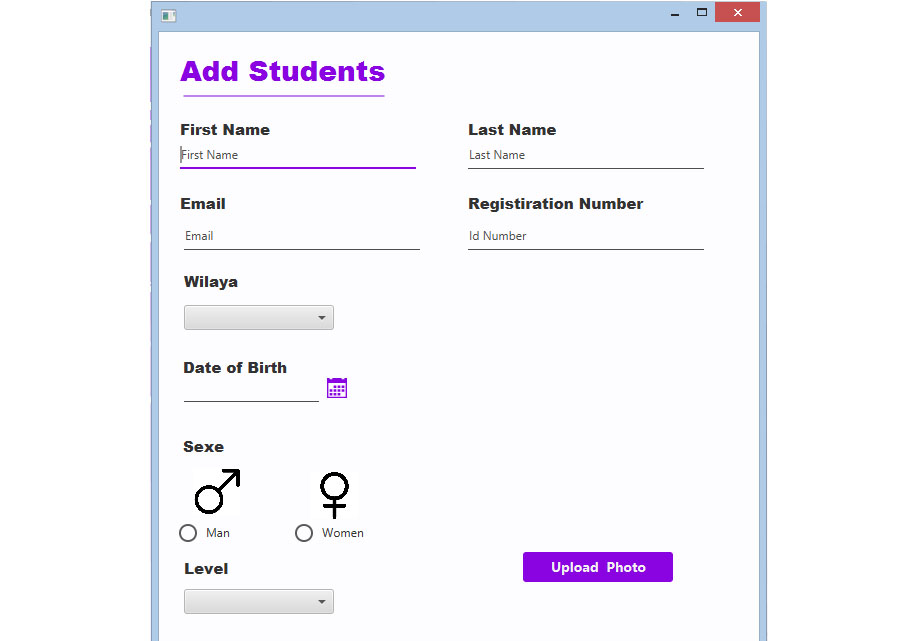
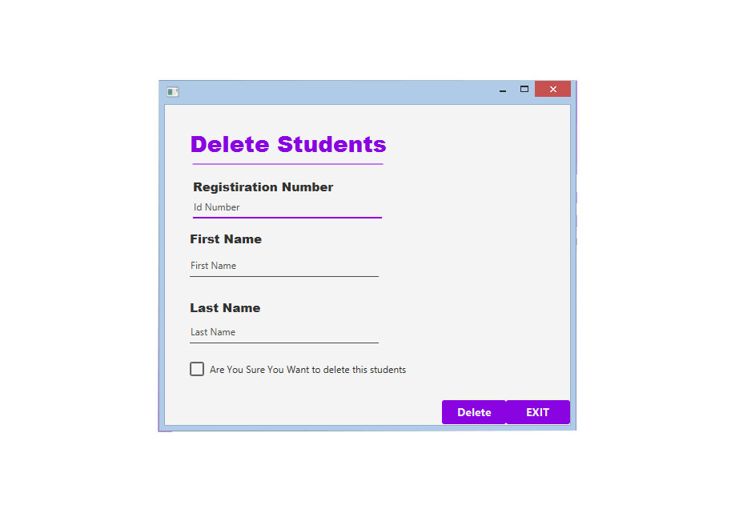
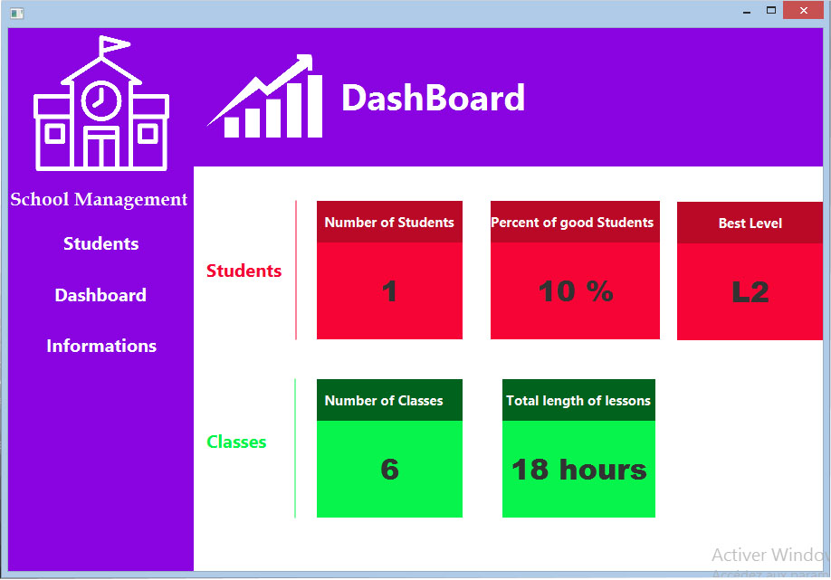
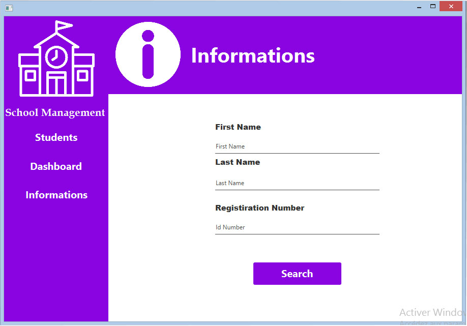
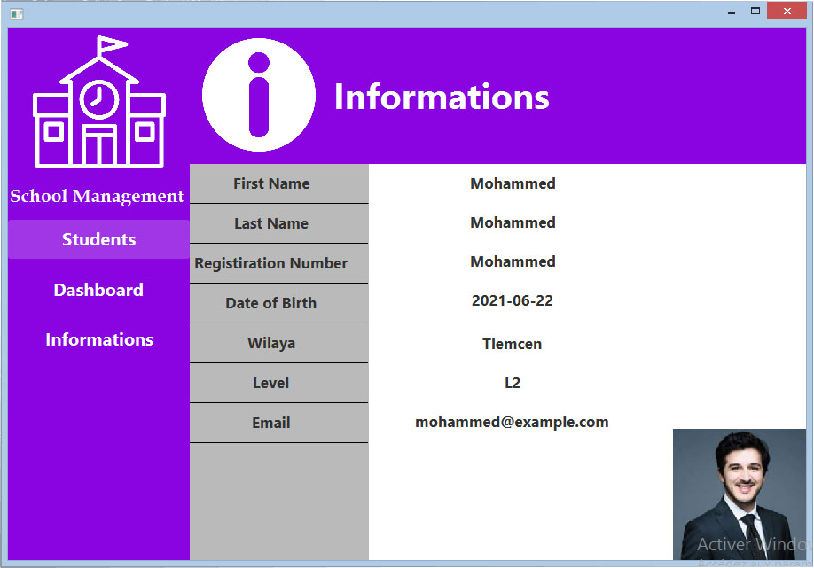

# School-Management-System-JavaFX
Demo for School Management System developed with javaFx And MySQL
## Screenshots

#### Login 

#### SignUp 

#### Home Page

#### Students 

#### Add Students

#### Delete Students

#### Dashboard

#### Informations

#### Show Informations

1. Adding Students to TableView
2. Delete Students
3. Show Informations about students
4. show the number of students

